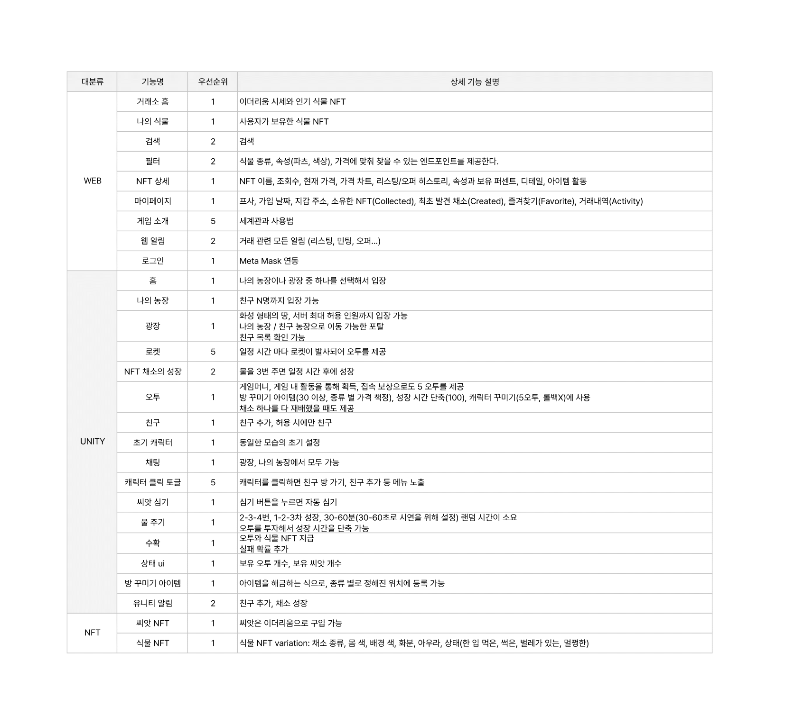

# [특화 PRJ 메타버스 도메인] On The Mars

태그: 중요 문서

### 프로젝트 개발 정보

| 개발기간 | 2023.02.20 - 2023.04.07 (7주) |
| --- | --- |
| 참여인원 | 6명 |

### 개발 역할 분배

|  |  |  |  |  |  |
| --- | --- | --- | --- | --- | --- |
| 이미현 | 김승섭 | 황수빈 | 안명수 | 나유진 | 이은지 |

### 프로젝트 목적

<aside>
📌 유저 개개인마다 마이룸 내에서 각자의 식물을 재배하는 **커스텀 파밍 게임**과 NFT 식물 카드의 수집 /거래활동을 합쳐, **NFT 라이프사이클**에 대해 익숙해질 수 있는 기회를 제공하고 재미까지 느낄 수 있는 서비스를 제작한다.

</aside>

### 프로젝트 기획 배경

[다가오는 메타버스 시대, NFT란 무엇일까?](http://www.dspress.org/news/articleView.html?idxno=11237)

[[메타 핫트렌드] NFT 빠진 메타버스는 ‘앙꼬없는 찐빵’](http://www.newsdream.kr/news/articleView.html?idxno=40804)

### 메타버스 세계관

- 22세기 멀지 않은 미래, 자원 고갈과 환경오염으로 멸망의 위기에 몰린 인류는 지구 바깥 우주로 눈을 돌리게 됩니다. 지구 탈출의 선두주자인 멜론 머스크를 따라 화성으로 떠난 여러분은 이제 새로운 보금자리를 위해 가진 모든 것을 쏟아 부어 테라포밍에 성공해야합니다. 그러나 화성은 너무나도 낯선 존재였습니다. 화성에서 친구를 만들고, 집을 꾸미며 힘들고 지친 우리 인류에게 식물들은 배를 채워주고 생존 에너지인 O₂를 제공해주는 고마운 존재였습니다. 그러나 배양 과정에서 화성의 미생물로 인해 예상치 못한 돌연변이가 발생하게 되는데…

# 서비스 주요 기능

## 웹 서비스

- 전체적인 로그인 시스템은 **MetaMask** 유저 정보를 활용해 게임 클라이언트와 웹 서비스 로그인을 통일할 예정.

### 게임, 세계관 소개 페이지

- 게임의 전반적인 세계관과 서비스 사용방법을 볼 수 있다.

### 거래소 홈페이지

- NFT 관련 정보를 살필 수 있는 NFT 기능의 홈페이지이다.

### 마이페이지

- 프로필 사진, 가입 날짜, 지갑 주소, 소유한 NFT(Collected), 최초 발견 채소(Created), 즐겨찾기(Favorite), 거래내역(Activity)을 확인할 수 있다.

### NFT 페이지

- [OpenSea](https://opensea.io/)를 벤치마킹한 형태의 NFT 거래소에서 자신의 식물 NFT를 등록하거나 새로운 식물 NFT를 구매할 수 있다.

### 게임시작

- On The Mars 게임에 참여할 수 있는 페이지이다.
- WebGL을 활용하여 Unity 클라이언트를 이식할 예정.

### 웹 알림

### 입장 페이지

- 나의 농장이나 광장 중 하나를 선택해 게임에 입장할 수 있다.
- 접속 보상으로 1일 1회 5 O2 (가정)를 제공한다.
- 방 꾸미기 아이템(30 이상, 종류 별 가격 책정), 성장 시간 단축(100), 캐릭터 꾸미기(5O2, 롤백X)에 사용, 채소 하나를 다 재배했을 때도 제공
- 친구 추가 가능하되, 허용 시에만 친구 가능
- 초기 캐릭터, 농장 상태는 동일
- 상단 메뉴바에 개인의 O2, 씨앗 수를 볼 수 있다.

### 마이룸, 내 농장

- 최대 N명까지 입장이 가능하다.
- 나의 농장에서 종자 NFT를 재배 식물 NFT로 재배할 수 있다.
- 씨앗은 이더리움(OTM 코인)으로 구매할 수 있다.
- 3회 ‘물주기’ 후 성장을 시작한다.(물주기에 대한 제한 조건은 예정 사항)
- 씨앗 ,  새싹 → 채소, 씨앗/새싹은 모두 동일한 형태이다.
- 채소는 특정 요소의 조합으로 뽑기된다.
- 유니티 마이룸에서도 보유한 채소 NFT를 전시할 수 있다.
- 내부에서 간단한 채팅이 가능하다.
- 해당 고정 위치의 아이템을 해금하는 식으로, 종류 별로 정해진 위치에 등록 가능하다.
- 2-3-4번, 1-2-3차 성장, 30-60분(30-60초로 시연을 위해 설정) 랜덤 시간이 소요
오투를 투자해서 성장 시간을 단축 가능
- 오투와 식물 NFT 지급, 실패 확률 추가

### 광장

- 화성 형태의 넓은 유저 전역 소통 구역.
- 가운데에 이벤트 용도의 NPC 오브젝트가 존재한다.
- 서버 최대 허용 인원까지 입장 가능하다.
- 사용자 본인의 농장 / 친구 농장으로 이동 가능한 포탈이 있다.
- 친구 목록을 확인할 수 있다.
- 전역 채팅과 말풍선을 이용한 소통이 가능하다.

## 기능 명세서

