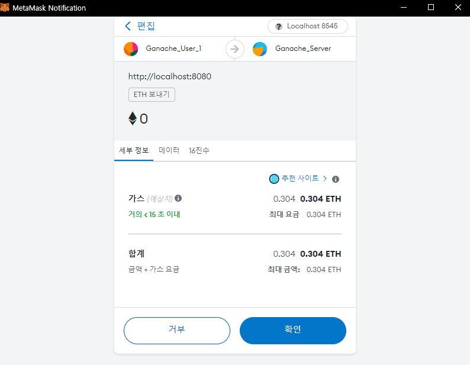

# [특화 PRJ] On The Mars

### 프로젝트 개발 정보

| 개발기간 | 2023.02.20 - 2023.04.07 (7주) |
| -------- | ----------------------------- |
| 참여인원 | 6명                           |

### 개발 역할 분배

| 팀장, FE | Unity, FE | FE, Figma | 배포, BE | NFT, BE | 검색엔진, BE |
| -------- | --------- | --------- | -------- | ------- | ------------ |
| 이미현   | 김승섭    | 황수빈    | 안명수   | 나유진  | 이은지       |

### 프로젝트 목적

📌 유저 개개인마다 마이룸 내에서 각자의 식물을 재배하는 **커스텀 파밍 게임**과 NFT 식물 카드의 수집 /거래활동을 합쳐, **NFT 라이프사이클**에 대해 익숙해질 수 있는 기회를 제공하고 재미까지 느낄 수 있는 서비스를 제작한다.

### 프로젝트 기획 배경

1. 인기 nft 사진 한장에 약 22억원이 넘게 거래가 되고 있다.

2. 메타버스 시장이 가파르게 성장 중이고, 꾸준한 관심을 받고 있다.

3. 게임 업계들이 메타버스 안에서 NFT 아이템을 이용하고 있다.

   네이버 제페토 X 크래프톤이 출시예정인 미글루는 크리에이터가 자체 코인 및 NFT(대체 불가능 토큰)을 발행해 수익을 창출할 수 있는 C2E(Creat to Earn) 시스템을 운영한다.

   [[단독] 크래프톤, 상반기 중 네이버와 '미글루' 합작법인 설립](https://www.hankyung.com/it/article/202303135437i)

### 메타버스 세계관

- 22세기 멀지 않은 미래, 자원 고갈과 환경오염으로 멸망의 위기에 몰린 인류는 지구 바깥, 우주로 눈을 돌리게 됩니다. 지구 탈출의 선두 주자인 머스크 멜론을 따라 화성으로 떠난 여러분은 이제 새로운 보금자리를 위해 가진 모든것을 쏟아 부어 테라포밍에 성공해야 합니다.
  그러나 화성은 너무나도 낯선 존재였습니다. 화성에서 친구를 만들고, 집을 꾸미며 힘들고 지친 우리 인류에게 식물들은 배를 채워주고 생존 에너지인 O₂를 제공해주는 고마운 존재였습니다. 그러나 배양 과정에서 화성의 미생물로 인해 예상치 못한 돌연변이가 발생하게 되는데…?!

## ✨서버 주소

### 개발

[🔒 https://j8e207.p.ssafy.io](https://j8e207.p.ssafy.io)

### 운영

[🔒 https://onthemars.site](https://onthemars.site)

### 젠킨스

[🔒 http://j8e207.p.ssafy.io:9090](http://j8e207.p.ssafy.io:9090)

# 서비스 소개

### 나의 농장(unity)

- 씨앗은 이더리움(O2 코인)으로 구매할 수 있다.
- 구매한 씨앗은 메타버스 안에서 심을 수 있다.
- ‘물 주기’를 해야 성장도가 올라간다.
- 성장이 완료된 작물은 랜덤 요소의 NFT로 발급된다.
- 보유한 채소 NFT를 전시할 수 있다.
  

### 진행상황

- 플레이어 캐릭터 <-> 물체 간 상호작용 확인
- 화분 내 위치 좌표로 특정 오브젝트 나타내기 확인
- 바라보는 오브젝트의 컴포넌트 제어 확인

### 작물 NFT

- NFT를 웹에서 거래할 수 있다.
- 거래량 상위 NFT를 확인할수있다.
- 웹 페이지에서 보유 NFT와 거래 중인 NFT를 조회할 수 있다.
- NFT 상세 조회를 할 수 있다.
- NFT 시세를 확인할 수 있다.

### O2 코인

- 자체 구축한 이더리움 테스트 네트워크에서 사용하는 코인으로, 서비스 상에서 사용하는 재화이다.
- 씨앗 구매, 작물의 성장 시간 단축, 캐릭터 꾸미기, NFT 거래에 사용된다.

### 진행상황
기능 1️⃣ 메타마스크 Local Ganache Network 자동 연결
1. metamask extension 설치하지 않으면 설치페이지 이동

2. metamask extenision 설치 후 로그인 시 private etheruem chain 연결한 적 없다면 chain 추가

3. private ethereum 체인과 자동으로 연결됨을 확인

기능 2️⃣ O2 구매 : User가 Server Address 로 송금

1. 페이지에서 구매 버튼 클릭 시 결제 유무 선택

2. private etheruem chain 에서 transaction 생성 확인

### 마이페이지

- 프로필 사진, 가입 날짜, 지갑 주소, 소유한 NFT(Collected), 최초 발견 채소(Created), 즐겨찾기(Favorite), 거래내역(Activity)을 확인할 수 있다.

---

## Figma

---

## 기능 명세서

[-> 명세서 보러가기](https://invented-marsupial-652.notion.site/b6b47aec77af4ac39cd78b51c8512927)

---

## API

[-> 연동 규격서 보러가기](https://invented-marsupial-652.notion.site/API-388e2d9d46b64415a82dd2ea807c9c77)

## Architecture 설계도

### Commit Message Convention

- `Comment` : 필요한 주석 추가 및 변경
- `Remove` : 파일 삭제하는 작업만 수행한 경우
- `NewBranch` : 새로운 브랜치를 생성할 경우
- `Feature` : 새로운 기능을 추가할 경우
- `Fix` : 버그를 고친 경우
- `Design` : CSS 등 사용자 UI 디자인 변경
- `Style` : 코드 포맷 변경, 세미 콜론 누락, 코드 수정이 없는 경우
- `Refac` : 프로덕션 코드 리팩토링
- `Docs` : 문서를 수정한 경우
- `Test` : 테스트 추가, 테스트 리팩토링 (프로덕션 코드 변경 X)
- `Chore` : 빌드 테스트 업데이트, 패키지 매니저를 설정하는 경우
- `Rename` : 파,일 혹은 폴더명을 수정하거나 옮기는 작업만인 경우
- `Merge` : PR을 요청하는 경우

---

### 네이밍 컨벤션

| 이름           | naming     |
| -------------- | ---------- |
| 사용자         | user       |
| NFT            | NFT        |
| 작물           | crop       |
| 씨앗           | seed       |
| 주소           | address    |
| 닉네임         | nickname   |
| url            | url        |
| 번호           | seq        |
| 숫자 단위      | cnt        |
| 프로필         | profile    |
| 등록날짜       | regDt      |
| 종료날짜       | endDt      |
| 오투           | oxy        |
| 조회           | view       |
| 생성자         | minter     |
| 소유자         | owner      |
| 리스팅         | listing    |
| 오퍼           | offer      |
| 즐겨찾기       | favorite   |
| 방꾸미기아이템 | decoItem   |
| 초             | sec        |
| 친구           | friend     |
| 캐릭터         | avatar     |
| 식별자         | id         |
| 가격           | price      |
| 속성           | attribute  |
| 거래 종류      | eventType  |
| 활성화         | activated  |
| 단계           | level      |
| 업데이트       | upt_dt     |
| 작물 상태      | cropType   |
| 티어           | tier       |
| 몸             | body       |
| 배경           | bg         |
| 눈             | eyes       |
| 색상           | color      |
| 유전           | dna        |
| 작물 복수형    | cropParent |
| 소유자         | owner      |
| 행 번호        | rowNum     |
| 열 번호        | colNum     |
| 판매자         | from       |
| 구매자         | to         |

- 숫자 단위 : cnt
  - ex ) cropCnt, viewCnt

### 다른 플랫폼과의 차별점

---

- 게임을 통해 얻은 아이템에 가치를 부여하여 사람들의 소유 욕구를 증가시킨다.
- 메타버스 게임 보상과 NFT 전시를 이용해 사용자의 수집 욕구를 극대화한다.
- NFT 조합 시 토큰에 저장된 유전 정보에 따라 희소성이 높아진다.

### 기대 효과

---

- 새로운 시장 창출
  메타버스와 NFT는 최근 가파르게 성장중이며, 농장 게임과 거래 서비스를 결합하여 새로운 시장을 창출할 수 있다.
- 게임 내 경제 시스템 구축
  게임 참여자들이 게임에서 농작물을 재배하고 거래를 통해 수익을 창출할 수 있다. 이는 게임의 참여도를 높이고, NFT 가격 변동에 따른 수익 창출 등의 요소를 고려하여 게임을 즐길 수 있는 새로운 경험을 제공한다.
- NFT 거래 플랫폼 제공
  NFT 거래 플랫폼을 제공하여 NFT의 거래를 원활하게 한다. 이는 NFT 시장을 체험하는 기회가 될 수 있다.
